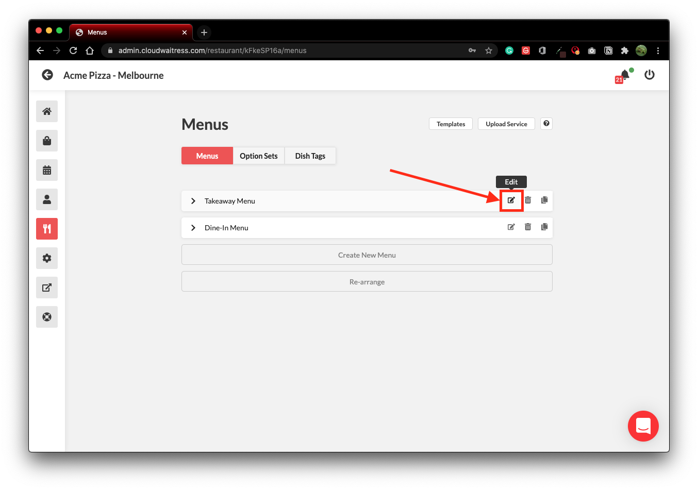

# メニューに直接リンク

メニューに直接リンク

あなたのメニューへの直接リンクを作成するには、かなりストレートなプロセスです。以下の例では、デモストア内の特定のメニューにリンクします。

```text
store-demo.cloudwaitress.com?menu_id=6kNXYMVEl
```

上記のURLをレストランのURLに置き換えてください。

```bash
store-demo.cloudwaitress.com > yourdomain.com
```

リンクしたいメニューのメニューIDを追加してください。

```bash
menu_id=6kNXYMVEl > menu_id=id from your menu
```


メニューIDは以下の手順で確認できます。


メニューIDの見つけ方

レストランの店舗にログインします。左側のメニューのナイフとフォークのボタンを使ってメニューセクションを選択します。そして、直接リンクしたいメニューの「編集」ボタンを押します。



メニューIDはページ上部に表示されます。このコードを使用して、上記の指示に従ってメニューに直接リンクしてください。


