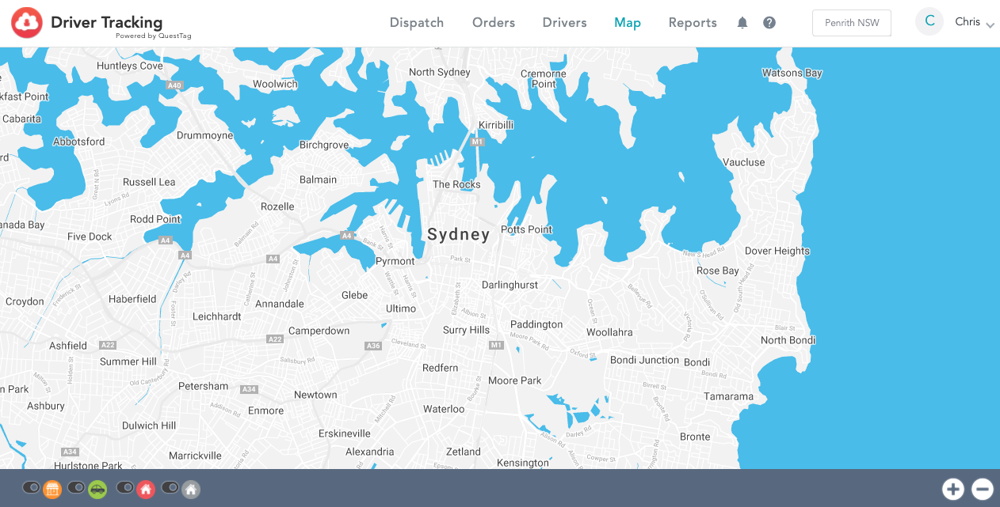

# ドライバー追跡を追加する方法

特徴

* 使いやすいダッシュボード クラウドウェイトレスの注文が自動的に追加される レストランと顧客のためのドライバーのリアルタイム追跡 ドライバーのためのモバイルアプリ お客様へのメール通知 ドライバーの支払いとチップの追跡 顧客へのテキスト通知（有料 自動配車（有料

## Set-up QuestTag Integration



1. CloudWaitressアカウント - admin.cloudwaitress.comを開きます。 統合したいレストランの「管理」を選択します。 設定」→「統合」→「QuestTagロゴ」をクリックします。 QuestTag.comのアカウントからQuestTag APIキーを貼り付けます。 'Enabled'ボタンにチェックを入れて保存を押します。 これで統合が開始されました。


待ち時間と自動ステータスが設定されていることを確認してください。そうでない場合、統合は機能しません。 以下を参照してください。設定 &gt; サービス &gt; 配達 &gt; 待ち時間と自動ステータス」を参照してください。


