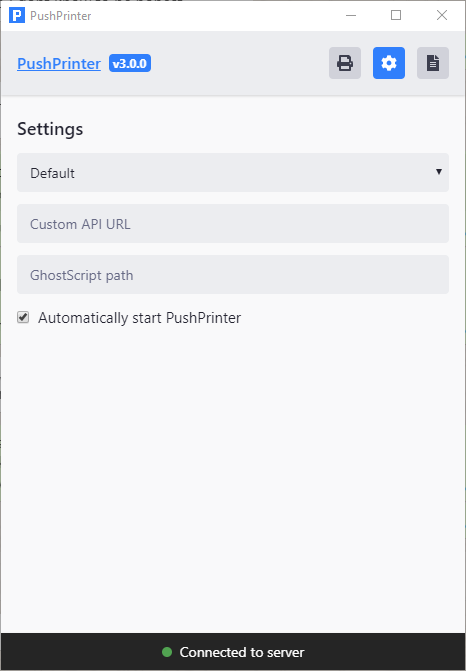

# 印刷設定 - Windows用の設定

当社のシステムでは、新規注文を手動および自動で印刷できます。このガイドでは、注文印刷を設定し、問題を解決する方法を説明します。

**要件**

* Windows 7/8/1032ビットまたは64ビット
* ドライバがインストールされたWindows互換プリンタ
* ダウンロードできるPushPrinterの最新版[こちら](https://www.pushprinter.com/)

セットアッププロセス

**プリンタドライーがインストールされ、機能していることを確認します**

1. ドライバが正常にインストールされると、プリンタはPCの\[コントロールパネル\]&gt; \[ハードウェアとサウンド\]&gt; \[デバイスとプリンタ\]の下に表示されます。
2. プリンタを右クリックして、\[プロパティ\]を選択します
3. 左下の「テストページの印刷」を押します。 
4. テストページが正常に印刷されたことを確認します 

これが成功すると、プリンタは正常に動作します。プリンターが見つからない、または機能しない場合は、ドライバーを再インストールしてください。

**利用可能な用紙サイズに注意してください**

この手順は、プリンター毎に異なります。一部のプリンターには、使用可能な用紙サイズを表示できる独自の設定ツールが用意されています。

デフォルトでは、前の手順で説明したように、この情報はプリンタの\[プロパティ\]ダイアログに表示される場合があります。これは、プリンターのプロパティの\[デバイス設定\]タブにある場合があります。

また、プリンターのプロパティの下部にある\[設定\]を選択してから、下部にある\[詳細\]を再度選択することもできます。

これがどのように見えるかを確認するには、下の画像を参照してください。  

問題なく動作させるには、いくつか試してみる必要がある可能性があるため、使用可能な用紙サイズに注意してください。

**プリンターの作成方法**

1. レストランの管理画面にアクセスし、\[設定\]&gt; \[領収書の印刷\]に移動します
2. 「新しいプリンタ」ボタンを押して、必要なオプションを入力します
3. \[用紙設定\]タブで、前の手順で説明したように、プリンタで使用可能な最大の用紙サイズに従って、用紙の幅と高さを設定します。上の画像から、幅「72」、高さ「210」を入力します。
4. フォントサイズを「18」、用紙の余白を「0」から始めることをお勧めします。
5. 印刷構成を作成します。作成後、接続するための一意のAPIキーを取得します。APIキーをすぐにコピーする必要があるため、この画面を開いたままにします 

\|\| プリンター設定に入力する用紙サイズは、プリンタードライバーオプションで設定されているWindowsの用紙サイズ設定と一致している必要があります。印刷された用紙の表示が正しくないか歪んでいる場合は、他のサイズを大きいものから小さいものまでテストする必要があります。プリンター設定でサイズを

**PushPrinterをインストールします**

1. PushPrinterをこちらから[ダウンロード](https://pushprinter.com)します。

2. インストーラーを実行すると、アプリケーションが未確認であるという警告が表示されます。インストールを続行してください

3. 正常にインストールされると、PushPrinterが自動的に開きます 

**PushPrinterを設定する**

1. はじめに「自動開始」スイッチを切り替えて、PCの起動時にPushPrinterが接続され起動するようにします。「Settings Cog」を選択し、「PushPrinterを自動的に起動する」ボタンにチェックマークを付けることでこれを有効にします（画像1.1）。
2. 上部の\[プリンタアイコン\]タブを押して、印刷サービスを設定します
3. 「プリンタの作成」ボタンを押します（画像1.2）。
4. 2ステップ前に作成したプリンターのAPIキーをコピーして貼り付けます
5. 印刷する部数を設定し、プリンタを選択します
6. スタートボタンを押して、下部に接続済みと表示されていることを確認します

### テストプリント

注文ページにアクセスしてください。注文を選択し、アクション選択バーの下で\[印刷\]を選択します。縦に切り取られていないことを確認するために、短い注文と長い注文の両方を印刷することをお勧めします。この印刷設定で自動印刷を有効にしている場合は、注文して自動印刷をテストしてください。

**トラブルシューティング**

**お問い合わせ**

数百台のプリンターのセットアップに成功しました。多くの問題を解決することができる可能性が高いので、遠慮なくご連絡ください。

**用紙端の印刷が切れてしまう**

管理画面のプリンタ設定で、余白または用紙幅の値を減らすことから始めます。最終的には、適切な幅とマージンを調整します。フォントサイズをもっと小さいものに調整することもできます。上記のガイドに示されているように、Windowsプリンタ設定で正しい用紙幅を取得できます。

**領収書の終わりが完全に出てこない**

Windowsプリンター設定の下。「印刷後のフィードライン」オプションを高い値に設定して、プリンターが数行余分にフィードできるようにします。

**無効なAPIキー**

入力したAPIキーは、どの印刷構成にも当てはまりません。APIキーを再確認してください

**認証できませんでした**

インターネット接続を確認するか、しばらくしてからもう一度お試しください

**Windowsでプリンターが検出されない**

Windowsで使用できる場合は、プリンターに適したドライバーを見つける必要があります。プリンタ名に続けて「windows {Windowsバージョンを挿入}ドライバー」という単語をGoogleで検索してみてください

**すべてが正しく設定されていても印刷が機能しない**

Windowsがプリンターを検出していることを確認してください。プリンタまたはPCを再起動してみてください。ブラウザなど、PC上の他のプログラムからプリンタに印刷してみてください。  

